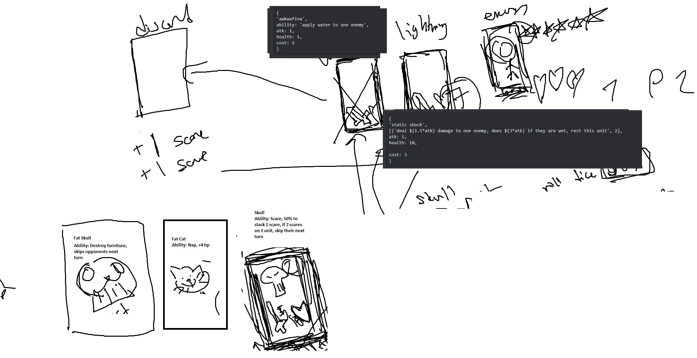

- card database lists possible cards
	- image for card, and attributes (card type)
	
Action items:
Alan
- handles game and game logic

Ronny
- handles data base, the cards
- user builds deck
- what cards they own and in their active deck
- make deck front end editor

Notes:
- database stores information of the player
	- credit card
	- ssn
	- cards in deck (card ids)
		- references db of all cards
	- cards owned

simple website
- user
	- deck editor
			- add, remove cards
			- purchase cards
	- profile
	- match history ?

admin panel
- card db management (CRUD)
- user management (CRUD)
	- edit user information
	- edit everything, like cards?
		- in an array format
            - cards: [1:4, 2:4, 1:1]

